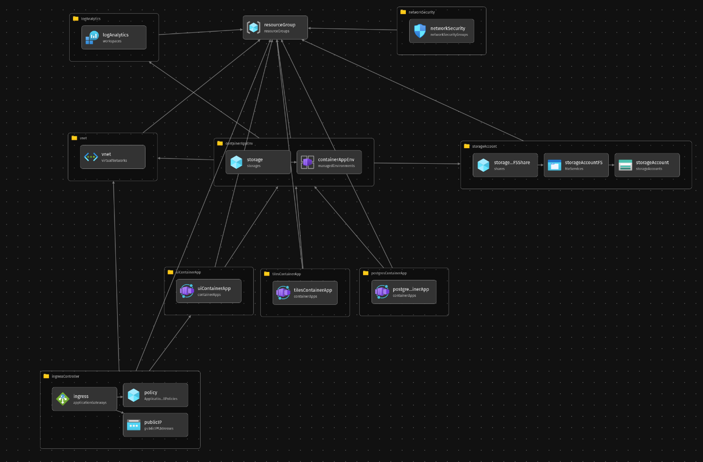

# Web-app deployment with BICEP

The main bicep file `main.bicep` creates a resource group which then contains all the resources shown in the architecture picture from the bicep VSCode extension.

The resource group will contain the following resources:

- Log Analytics workspace: Connect to the container app environment and collects logs from all containers. Stores system logs and console logs for running containers.

- Storage Account: A storage account that can be used to store presistend data for container apps. This would be used for the database container. However, we found out that it is not possible to use an 'AzureFile' storage for our postgres database, because it does not support hard-links, which are required by postgres. There is an 'NfsAzureFile' storage type as well, but this seems to be rather new and we could not find much information on how to set it up for our postgres container.

- Virtual Network: A virtual network for our container apps and the ingress. Here we defined a subnet for the container apps and a subnet for the ingress.

- Container App Environment: An environment to deploy our container apps to. The container app environment is connected to a subnet in the virtual network, thus all our containers are deployed within the same subnet and can send requests to each other by their container name.

- Container Apps: There are 3 container apps, one for each of our service:
    1. UI container app: The user interface of the web site. Serves static data to the client and requests data from the tile server.
    2. Tile server container app: The tile server provides tiles to the UI container for displaying data on a map.
    3. Database container app: The database container that provides data for the tile server.

- Ingress: An ingress that handles connections to the internet. 

## How to deploy

Navigate to the directory containing [main.bicep](./infra/main.bicep) file and execute the following command:
`az deployment sub create --template-file main.bicep -l westeurope`
This deploys the resource group defined in main.bicep in the westeurope region to the currently logged in users azure account.

This requires the Azure CLI and the Bicep CLI to be available on the system and a user to be logged in with `az login`.

To check if Azure CLI/Bicep CLI is available run `az version`/`az bicep version`.

## About the deployed app

The currently deployed app is the demo application from the [martin server repository](https://github.com/maplibre/martin). This consits of a postgres database with the postgis extension, a martin server as backend for providing tiles to a frontend. The frontend is a simple website that shows the capabilities of martin server.